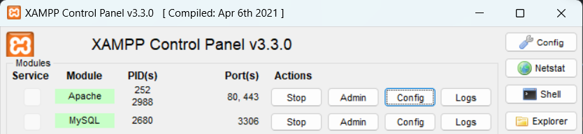
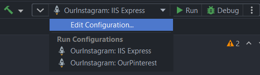

<h1 align="center">
    Bài tập lớn
    <br>
    Công nghệ phần mềm
    <br>
    Nhóm 6
    <br>
</h1>

<p align="center"></p>

<p align="center">
	
</p>

<p align="center">
	<a href="#team-members">Team members</a> -
	<a href="#introduction">Introduction</a> -
	<a href="#technology-in-use">Technology</a> -
	<a href="#get-started">Getting started</a> 
</p>

## Team members
* A25962 Lê Đức Trung
* A38659 Phạm Trung Nguyên
* A38861 Đặng Huyền Trang
* A40807 Đoàn Tuấn Khang
* A41156 Đỗ Ngọc Hiệp
* A41174 Hoàng Chí Hiếu

## Introduction
* Website giúp người dùng dễ dàng đăng tải và theo dõi ảnh của mọi người.

## Technology in use
* Framework: <a href="https://dotnet.microsoft.com/en-us/apps/aspnet/mvc"> ASP.NET MVC </a>
* Database: <a href="https://www.apachefriends.org/download.html"> MySQL </a>
* Frontend: HTML, CSS, JAVASCRIPT
* Backend: C#

## Getting Started
1. Tải thư mục Project hoặc Clone Project
````
https://github.com/elytrace/Pinsta.git
````
2. Tải <a href="https://www.apachefriends.org/download.html">XAMPP</a> bản mới nhất, sau đó cài đặt và bật <strong>XAMPP Control Panel</strong>.
<br><br>
3. Start <strong>Apache</strong> và <strong>MySQL</strong>.

<br><br>
4. Cài đặt 1 trong 2 IDE <a href="https://visualstudio.microsoft.com/vs/community/">Visual Studio</a> hoặc <a href="https://www.jetbrains.com/rider/">Jetbrains Rider</a>.
<br><br>
5. Mở Project bằng cách chọn file <strong>.sln</strong> trong cây thư mục:<br>
````
Pinsta.sln
````
<strong>Lưu ý:</strong>
<br>
Nếu sử dụng <strong>Visual Studio</strong> thì thay đổi <strong>.Net SDK Version</strong> thành 7.0.0 trong file <strong>global.json</strong>.
7. Ở góc trên màn hình, thay đổi <strong>Run Configuration</strong> thành <strong>IIS Express</strong> sau đó <strong>Run</strong>.

